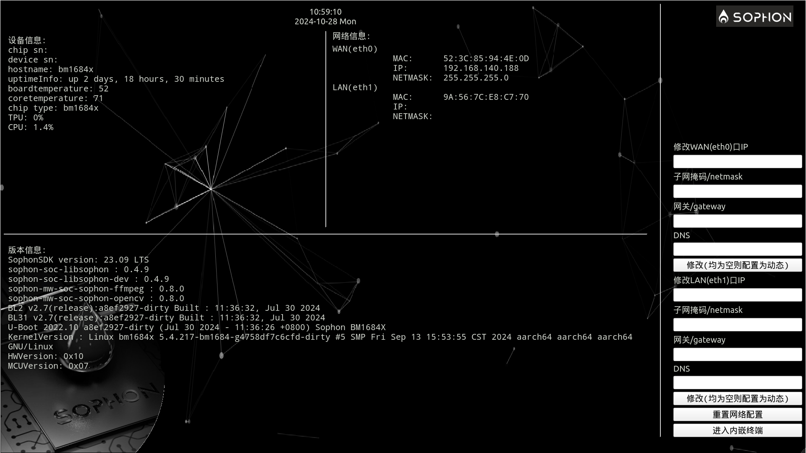

# HDMI配网工具

## 适用场景

* 芯片：BM1684 BM1684X BM1688 CV186AH
* SDK版本：
  * 84&X V23.03.01 之后版本
  * 1688/186 V1.5以及之后版本

## 功能介绍

整个界面分为左右两个部分，左边是信息展示，显示设备信息、版本信息、网络信息。右边是网络配置和其他配置。

主要功能如下：

1. 显示实时的设备信息、版本信息和网络信息
2. 通过 `bm_set_ip` 和 `bm_set_ip_auto` 对设备网络进行配置
3. 可以启动外部配置的demo程序
4. 可以对网络进行重置
5. 内嵌一个小型终端，可以用于临时的环境配置和信息查看
   > 由于没有X11的支持，该终端很简陋，可能不支持某些操作。仅用于临时的环境配置和信息查看

支持自定义的部分如下：

1. 界面支持改为全英文（环境变量 `SOPHON_QT_EN_ENABLE` ）
2. 设备信息、版本信息支持修改（环境变量 `SOPHON_QT_1` `SOPHON_QT_2` ）
3. 重置网络功能支持自定义操作（环境变量 `SOPHON_QT_4` ）
4. 图片背景可以自定义（环境变量 `SOPHON_QT_BG_PATH` ）

## 编译注意事项

1. 本工具基于QT5.12开发
2. 本工具的嵌入式终端来源于 `lxqt` 的 `qtermwidget` 方案，仓库默认自带arm64的库文件，如果需要在非arm64架构编译，需要自行准备库文件
