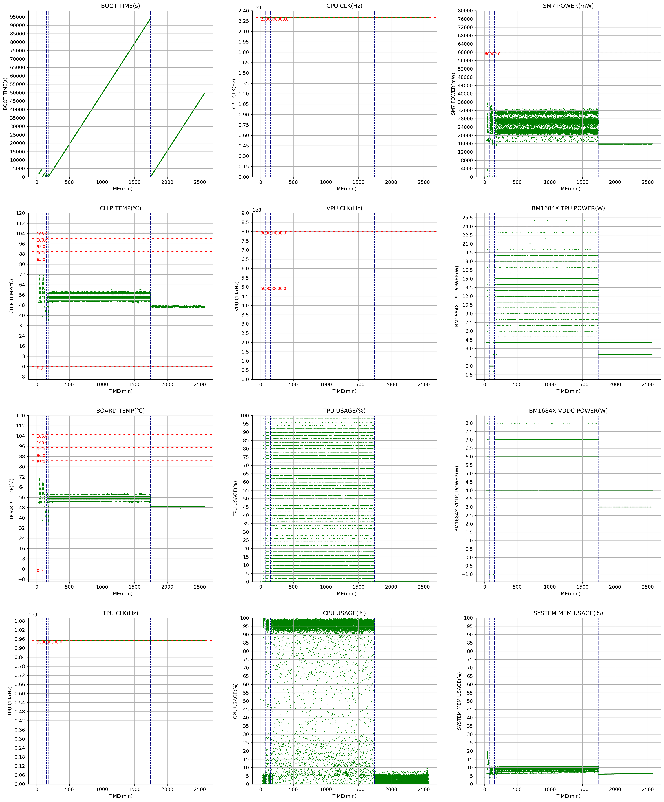

# get_info 算丰设备信息获取脚本

## 文件说明

``` bash

.
├── get_info_log_to_png.py
├── get_info_log_to_png.yaml
├── get_info.sh
├── readme.md
└── release.sh

```

* get_info_log_to_png.py 将get_info记录的log文件可视化的程序
* get_info_log_to_png.yaml 将get_info记录的log文件可视化的程序的配置样例
* get_info.sh 设备信息获取脚本
* readme.md 说明
* release.sh 输出脚本

## 使用说明

### get_info.sh

#### 普通使用方式

``` bash

sudo bash get_info.sh

```

直接获取信息

#### 服务记录方式

``` bash

sudo bash get_info.sh server <log file> <loop time> y

```

自动启动一个后台服务，每隔\<loop time\>时间获取一次信息到文件<log file>，使用并配置开机自启的实例视频如下

https://github.com/user-attachments/assets/819bf5cd-c619-41b9-9e88-1c4dcba9c70a

#### 特殊环境变量说明

1. get_info默认不会使用pmbus工具记录PMIC相关信息，如果需要，请确保除了get_info之外没有其他任何程序在操作PMIC，然后配置环境变量`GET_INFO_PMBUS_ENABLE=1`后运行get_info即可

### get_info_log_to_png.py

``` bash

python3 get_info_log_to_png.py --config get_info_log_to_png.yaml --log get_info.log

```

将上述`get_info.sh`生成的log文件输出为图形化的png图表，详细配置可参考文件`get_info_log_to_png.yaml`，生成实例如下



